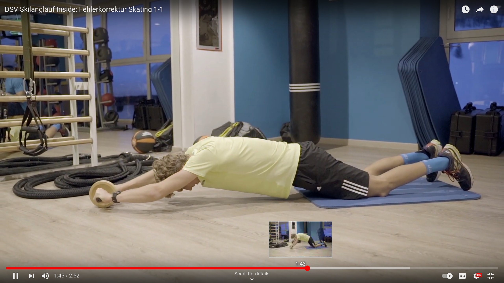

# Wachsen / Waxing
- Bügeleisen Temperatur: Seide / (Wolle). Wenn der Wachst verbrennt (raucht), so ist es zu heiss
- eine Schicht "TOKO Base prep (NF)" / "Swix Base black", 20-30min abkühlen bei Raumtemperatur, abziehen
- eine Schicht "passender Wachs", 20-30min abkühlen lassen, abziehen, ausbürsten mit Nylon bürste, finish ausbürsten mit Rosshaarbürse

## Links
- [Engadin Wachstipps](http://www.engadin.ch/de/services/wachstipps)
- Wachstipps @ bergzeit.ch
- Langlaufski wachsen @ fischersports.com
- [Wachstipps Grabünden](https://www.graubuenden.ch/de/news-tipps/2020/11/expertentipps-wachsen-und-tuning-langlaufski)

## Wiki-References
- [Gadgets Langlauf](wiki/Gadgets.md#Langlauf)
- [Gear_Gadgets_Shopping](Gear_Gadgets_Shopping.md#Langlauf)
- [Tips and Tricks / How to](aol_tips_n_tricks.md#Langlaufen)

# Technik

## Skating
- [DSV Sakilanglauf Inside: Fehlerkorrektur Skating 1-1](https://www.youtube.com/watch?app=desktop&v=Hu9angAeFcs) (1 Rumpfübung und 1-Beinübungen)
- [DSV Skilanglauf Inside: Fehlerkorrektur Skating 2-1 mit aktivem Armschwung (Pendelschritt)](https://www.youtube.com/watch?v=3LhFXy73PeY)
- [DSV Skilanglauf Inside: Fehlerkorrektur Skating 2-1 am Anstieg (Bergschritt)](https://www.youtube.com/watch?v=fVDO79hFxAc) (mehrere Rumpfübungen)
- [Intensives Techniktraining der DSV-Langläufer mit Axel Teichmann](https://www.youtube.com/watch?app=desktop&v=jQRIfJzw478)
  - Vorverlagerung des Oberkörpers / permanente Vorlage
  - "hohe Hüfte"
  - Vorlage -> Vortrieb (benötigt Rumpfstabilität)

- asynchroner / verzögerter Stockeisatz und Beinabstoss
- Hände und Ellbogen hoch
- **nach vorne aufrichten**, nicht nach oben!!
- aus dem Fussgelenk arbeiten (auch beim Joggen)
- immer wieder neue Reize setzen

# Training
- [DSV Fitness mit Markus | Ski Langlauf Total Body Workout mit Steffi Böhler](https://www.youtube.com/watch?v=SWrZW-d5DuE)

## Rumpf Stabilität / Core

, e.g. use carpet

- take some screenshots from [Stabilisationstraining (14 Übungen zum Mitmachen)](https://www.youtube.com/watch?v=Dd4nivJ3uWE)

## Beine

