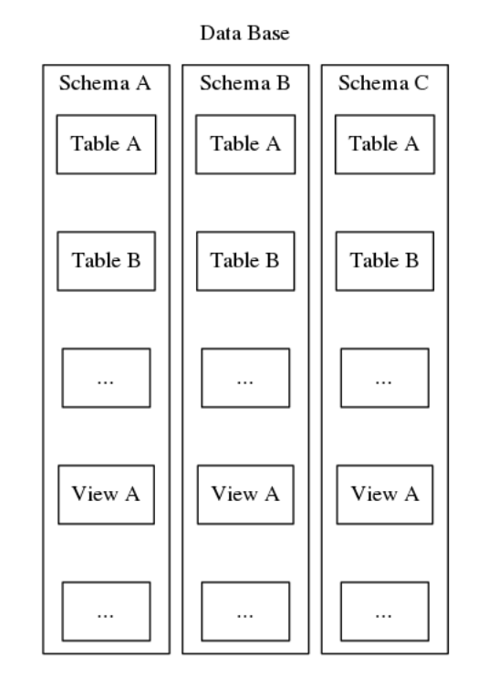

stackoverflow 34098326

# Create DB

# Schemas
In the Postgresql world, the term **schema** might be better understood as a **namespace**. In fact, in the Postgresql system tables, schemas are recorded in table columns called **name space**, is more accurate terminology. As a practical matter, whenever I see **schema** in the context of Postgresql I silently reinterpret it as saying  **name space**[^1]. A name space is a rather flexible means of organizing and identifying information by name. While a database may contain many schemas, there is only ever one level and so within a database, schema names must be unique. Also, every database must include at least one schema. Whenever a new database is instantiated, a default schema named “public” is created. The contents of a schema include all the other database objects such as tables, views, stored procedures, triggers, and etc.



Besides simply organizing database objects into logical groups to make them more manageable, schemas serve the practical purpose of avoiding name collision ([see source](https://severalnines.com/blog/postgresql-schema-management-basics)).

## Create Schema

Bash:

### Interacvie Shell:
```sql
CREATE SCHEMA my_schema;
CREATE SCHEMA schemaname [ AUTHORIZATION username ] [ schema_element [ ... ] ]
```

So for example, to create a schema named “hollywood” containing a table named “films” and view named “winners” in one command, you could do
```sql
CREATE SCHEMA hollywood
    CREATE TABLE films (title text, release date, awards text[])
    CREATE VIEW winners AS
        SELECT title, release FROM films WHERE awards IS NOT NULL;
```

Additional database objects may be subsequently created directly, for example an additional table would be added to the schema with
```sql
CREATE TABLE hollywood.actors (name text, dob date, gender text);
```

The current schema is derived from the “search_path” configuration parameter. This parameter stores a comma-separated list of schema names and can be examined and set with the commands
```sql
SHOW search_path;
SET search_path TO schema [, schema, ...];
```

The comma-separated list of schema names also serves to determine the search order by which the system locates existing unqualified named objects.
The system searches for tables, views, and other objects within schemas in the order of the search_path, and then the first found name match object is used. Schema-qualified named objects are used directly without reference to the search_path.
If we anticipated creating all objects within a specific schema "hollywood", then it might be convenient to set the search_path variable such as
```sql
SET search_path TO hollywood,public;
```

There is also a *system information function* which returns the current schema with a query
```sql
select current_schema();
```

You  can also change the name of a schema or drop / delete it
```sql
ALTER SCHEMA old_name RENAME TO new_name;
DROP SCHEMA schema_name;
```

The DROP command will fail if the schema contains any objects, so they must be deleted first, or you can optionally recursively delete a schema all its contents with the CASCADE option
```sql
DROP SCHEMA schema_name CASCADE;
```

The main refrence is [severalines blog](https://severalnines.com/blog/postgresql-schema-management-basics).  Other references:
- [tutorialspoint.com/postgresql](https://www.tutorialspoint.com/postgresql/postgresql_schema.htm)
- [postgresqltutorial.com/schema](https://www.postgresqltutorial.com/postgresql-schema/)

## Link Schema

# Tables


# Useful commands


[^1]: In the Postgresql world, the term “schema” is maybe somewhat unfortunately overloaded. In the broader context of relational database management systems (RDBMS), the term “schema” might be understood to refer to the overall logical or physical design of the database, i.e., the definition of all the tables, columns, views, and other objects that constitute the database definition. In that broader context a schema might be expressed in an entity-relationship (ER) diagram or a script of data definition language (DDL) statements used to instantiate the application database.

